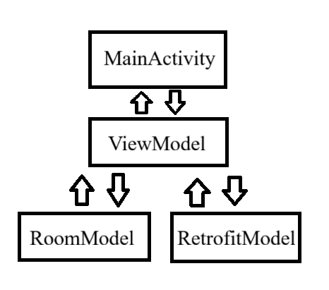

# The Barometer 
#### A weather forecast app

### Note
For running the app you will need to enter your api key in strings.xml

## Requirement Analysis
### Objective
- Develop a simple Android app that displays a 3-day weather forecast for a selected city.
- The app should support offline access by saving the last fetched forecast data locally. 
### Functional Requirements
1. User should be able to select a city from a list of available cities.
2. Weather data to show 
   1. Date
   2. Temperature
   3. Weather conditions (sunny, rainy etc) with an icon.
3. After Selecting the city The app will display the above data in a readable tabular format.

### Non Functional Requirements
1. The app should support offline access by saving the last fetched forecast data locally.
2. The stale data should be removed periodically to free space.
3. App should be fast and bug free.
4. An error should be displayed when not able to fetch the data.

### App Structure
1. This app can be a single Activity since only fetching and displaying the data is the main focus.
2. The code is done using MVVM architecture and Standard Android guidelines.

### ScreenShot

### Structure

